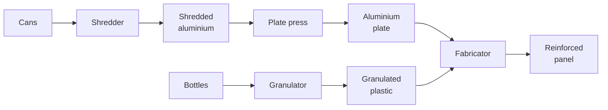
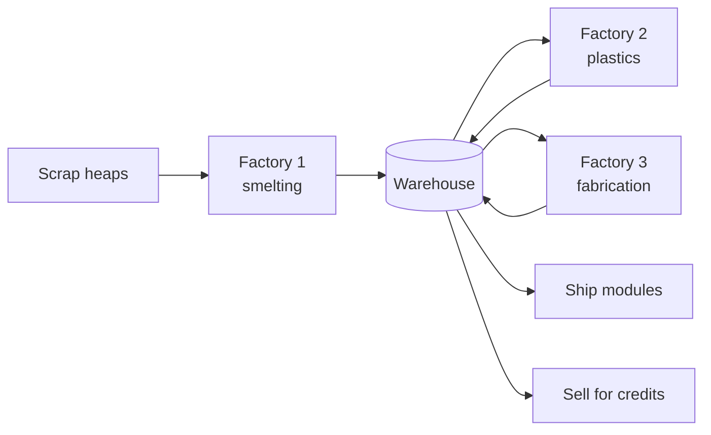

# ScrapLine Long-Term Vision

Sep 23, 2026 · updated Sep 24, 2026 · @Narike

## Premise

The game ends with a spaceship built out of recycled rubbish, launched off a planet that has become a landfill. The player is the last recycler on it, and every part of the ship comes from scrap they processed themselves.

The fiction is "landfill planet", not "escape Earth". The difference matters for two reasons. First, abandoning a world you have spent a hundred hours cleaning up reads oddly; leaving a world that was always a dump does not. Second, it earns the game's central economic assumption — that scrap is effectively infinite and purchasable forever — instead of leaving it as an unexplained convenience.

The tone is trash-to-treasure with a straight face. The joke lands on its own: the rocket is made of drink cans.

## What kind of game this is

ScrapLine is a long-term idle game of roughly 100 hours, played on a phone, with offline progression on. That classification is the most consequential decision in this document, because almost every number in the game follows from it.

Three things follow immediately:

- **Process times are pacing, not friction.** In an active puzzle game a 10-second machine is a thing you watch. In an idle game it is a rate that multiplies against hours. Machine speeds stop being about feel and start being about throughput per day.
- **The 30–45 minute slice is session one, not the game.** It is the tutorial: about 0.5% of total playtime. Its job is to teach four verbs — place, connect, process, combine — and hand the player to the blueprint. It is not a complete arc and should not be balanced as one.
- **Balancing by playtest alone is not possible.** Nobody can hand-tune 100 hours by playing them. The economy needs a model that can be evaluated without playing it; see Engineering implications.

The current build is not an idle game yet. `SimulationClock.Time` reads `UnityEngine.Time.time`, which resets to zero on every launch, so nothing accrues while the app is closed. Turning that into wall-clock time is the first structural change the vision requires.

## The core loop and its three currencies

The ship is not flavour. It introduces a class of item the player does not sell, and that single change alters what the game is about.

Today every item exists to be converted back into credits. Credits are the only score, the only sink and the only goal, which makes the game a treadmill with no terminus. Once ship components exist, the question changes from "how do I maximise income" to "how do I produce forty reinforced panels". That is a throughput-and-layout question, which is the question a factory game should be asking.

The game runs on three currencies with distinct jobs:

| Currency | Earned by | Spent on | Role |
| --- | --- | --- | --- |
| Credits | Selling processed materials | Licences, construction, grid expansion, scrap heaps, factory sites, module installation | Buys capability |
| Materials | Processing scrap through machines | Selling, or as recipe inputs | The working medium |
| Ship components | Fabricating specific high-tier recipes | Installing into ship modules — never sold | The terminus |

The important property is that components are a one-way sink. Credits buy the ability to make them; they never buy the components themselves. That keeps the endgame about production rather than about a bank balance, and it means a rich player still has to build the factory.

## Offline progression: the scrap heap is the fuel tank

Offline earnings are capped by the scrap the player bought before they left, not by an arbitrary offline timer. The factory runs until the heap is empty and then stops. This is the best idea in the design and most of the economy should be built around it.

Offline runtime is a straight division:

```latex
t_{\text{offline}} = \frac{\text{items in heap}}{\text{spawn rate}}
```

Offline resolution uses a hybrid model: simulate short warm-up and drain windows accurately, and
solve the long steady-state middle as aggregate throughput. Elapsed time comes from persisted UTC
timestamps. A clock that moves backwards awards no offline progress and does not lower the saved
high-water timestamp. A large forward jump may consume only the scrap the player actually bought;
there is no separate arbitrary offline-time cap. Suspicious clock movement may make a result
ineligible for community comparison, but never blocks personal progression or completion.

At today's values a starter crate of 25 cans against a 5-second spawner gives 125 seconds. A heap of 20,000 items gives about 28 hours. Buying a bigger heap *is* buying offline duration, which makes the relationship legible without a word of explanation.

What this buys the design:

- **No idle-game exploit.** Someone who leaves for three months comes back to one heap's worth of output, not three months of compound credits.
- **A real decision with every purchase.** Spend on a bigger heap for longer unattended running, or on machines for a higher rate while watching. Both are correct at different times.
- **A natural reason to return.** The line is dry, and the player knows roughly when it will be.
- **One dial governs pacing.** Heap size and heap price together set how much of the game is played actively and how much accrues in the background.

Two consequences worth stating now. Heap capacity has to grow by orders of magnitude across the game, not by the 25-to-50 steps in `wastecrates.json` today, because it is tracking session length rather than a shopping basket. And the spawner's queue and the heap need to be clearly separated in the UI, because the heap becomes the thing players check before closing the app.

## Tech tree: widen, don't ladder

The design rule is that every new tier consumes outputs from at least two existing branches. Tiers never replace each other; they recombine.

The trap with "lots of materials" is the ladder, where each tier is strictly better than the last, old machines fall idle and the factory gets rebuilt rather than extended. Factory games die that way. The current chain already has the right shape and it should be made an explicit constraint on every future recipe.



Reinforced panels need one aluminium plate and five granulated plastic, so unlocking the fabricator makes the shredder and the granulator *more* valuable, not obsolete. Repeat that at every tier and the factory grows in area for a hundred hours, which is exactly what makes floor space the long-term pressure.

The corollary is that machine count should stay modest. Fifteen to twenty buildable machines is a realistic ceiling, because each one costs a config panel, a sprite set, mobile UX and a balance pass. Depth comes from recipe breadth and from machine upgrades instead — and the data for upgrades is already written (see Engineering implications).

## Guidance: objectives hand off to the blueprint

Objectives end and the ship blueprint unlocks in the same moment, so there is never a stretch of play with no stated goal.

The two systems are the same data with the ordering removed. An objective chain is prerequisite-linked, shows one recommendation at a time, and tells the player what to do. A blueprint shows every component and count at once and lets the player choose what to work toward. Guidance changes character rather than disappearing, and the player graduates from being told to deciding.

**Modules, not one bar.** A single "deliver 500 panels" meter is a grind. Six to ten modules — hull, drive, life support, navigation, fuel, cargo — each with its own component list and material demands, turns a hundred hours into chapters. Every completed module changes a rocket illustration, which is the visible progress an idle game needs when the numbers get large.

The full ship and every module are visible when the blueprint unlocks. Modules have no artificial
completion order: the player may select, contribute to and complete any of them, with partial
contributions preserved. Material capabilities and production difficulty create natural progression;
the UI may recommend an approachable module but never makes that recommendation a prerequisite.

At roughly 100 hours and eight modules, a module is about 12 hours of play. That is a chunky chapter, so each one needs internal structure: two or three components, each with its own production problem, rather than one long haul.

The existing objective system stays for the tutorial and should not be stretched to cover the whole game. It is the right tool for the first 45 minutes and the wrong one for hour 60.

## Space: expand the factory, then buy another one

Space grows on two axes. Early, the player widens a single factory a row or column at a time. Later, they buy whole new factory sites and link them. The second axis is what makes a hundred-hour game survivable on a phone.

The launch planning target is four factory sites. Each begins at roughly 5×7 and can grow to
approximately 8×10. These are economy-model inputs rather than permanent hard limits, so playtest
evidence may change them without changing the architecture.

One grid cannot scale to the endgame. A dozen machine types running at ratio would need something like a 30×30 grid, which is unreadable and untappable on a handset. Four to six factories of roughly 8×10 hold the same machine count, each one legible, each one a screen the player can actually reason about. This also solves a design problem for free: a factory gets a *purpose* — the plastics plant, the plate works — rather than being one undifferentiated sprawl.

**Linking them.** The clean model reuses concepts already built. A seller on the top edge is a destination; add a port that sends output to a shared warehouse instead of selling it. A spawner on the bottom edge is a source; let it draw from the warehouse instead of from a heap. Nothing new is invented, and the ship blueprint simply consumes from that same warehouse.

The warehouse has unlimited capacity in the first full version. Scrap heaps already supply the
important capacity constraint, and a second storage limit would add UI and balancing cost before it
has demonstrated value. The save model should permit a future capacity field without requiring one.

Machine licences are global. Buying a Shredder licence once permits construction in every factory;
construction costs, machine-count limits and floor space create the local decisions. Rebuying the
same capability per site would feel like a tax rather than progression.



**Pacing.** Grid expansion is the early-to-mid sink and needs a genuinely exponential curve; today's `baseCost + area × growthFactor` gives 170, then 184, then 198 on a 5×7 grid, which is nearly flat and cheaper than every non-starter licence, so expanding is always correct. A new factory site is the late-game sink and should cost a large multiple of any single expansion, so that the choice between widening and opening a new site is a real one.

## Economy dials and the 100-hour pacing model

Six dials control the whole economy. Everything else is a consequence of them, and they should live in one configuration file rather than scattered across JSON and Inspector fields.

| Dial | What it controls | Today |
| --- | --- | --- |
| Heap price per item | The floor under all income | 1.6 credits/item |
| Processing value multiplier | Why you build machines at all | ×3 per step (2→6→16) |
| Licence cost | Time-to-capability | 100–600 credits |
| Construction cost | How many copies you run | 100–500 credits |
| Expansion curve | Floor space, the core constraint | Near-flat, needs replacing |
| Module install cost | Late-game credit sink | Does not exist yet |

The master ratio is processing multiplier against heap price. A can bought at 1.6 and sold raw at 2 yields 25%; shredded it yields 275%; pressed into a plate, 900%. That gap is the entire argument for building a factory, and it has to stay roughly constant across tiers or late machines stop being worth their licence.

**Pacing shape.** Idle games pace on time-to-next-meaningful-purchase, which should grow from minutes in session one to hours by mid-game and most of a day by the end. Against 100 hours and eight modules, a workable skeleton is tier 1–2 in the first hour, roughly one new material branch every 8–12 hours, and the last two modules taking as long as the first four.

**Credits must not become irrelevant.** Once components are the goal, a player with a working line accumulates credits faster than they can spend them. Module installation costs, steeply rising expansion, new factory sites and higher-tier heaps are the four sinks that keep credits meaningful to hour 100. At least three of the four need to exist.

The initial calibration target is four factories expanding from roughly 5×7 to 8×10. The economy
model must expose both site count and size as inputs so those targets can be adjusted after testing.

## What this means for the vertical slice

The 30–45 minute slice should be rescoped from "a balanced arc" to "session one of a hundred hours". Most of the issue survives that change; three things need adding and one needs removing.

**Add: show the ship in the first five minutes.** A locked module list or a rocket silhouette with every stage greyed out. Without it the slice is a well-tuned treadmill with no visible horizon, and the player has no reason to believe there is a game beyond the panel they just made.

**Add: end the session by selling them a bigger heap.** The player's first return is where the idle promise is either established or missed. A starter crate lasts about two minutes, so if they close the app on one, nothing will have happened when they come back. The last tutorial beat should put a multi-hour heap in the spawner.

**Add: wall-clock time before tuning anything.** Every process time and price in the slice is a rate against hours once offline progression exists. Tuning them against session-local time first means tuning them twice.

**Remove: the assumption that the slice ends the arc.** "Reinforced panels" is not a destination, it is the first component the ship needs. The completion moment should read as a beginning — the blueprint unlocking — rather than a credits roll.

The issue's six milestones, crate gating, sorter and fabricator UX work, and recipe displays all stand unchanged. The licence-versus-construction pricing pass and the expansion curve should wait for the dials above to be settled, or they will be tuned against the wrong model of the game.

## Engineering implications and risks

**Offline resolution is the hard problem.** You cannot step eight hours of per-item movement at 60fps on a phone. Three approaches: fast-forward at a coarse timestep (simple and exact, but cost grows with elapsed time); solve analytically for the line's bottleneck rate and multiply by elapsed time (instant, but hard to get right with sorters, multi-input recipes and partial heaps); or a hybrid that simulates a short warm-up and drain window and solves the steady state in between. The hybrid is probably right, and it deserves its own spike before anything else is committed to. Device clock tampering needs a decision too.

**Save format churn.** Wall-clock timestamps, multiple factories, the warehouse and blueprint state are all save changes. They should land as one versioned migration rather than four, which argues for doing the save-versioning work first.

**There is a whole progression axis already written and unused.** `machines.json` authors `maxNumber`, `upgradeMultipliers` and `upgradeMaxNumbers` with full cost tables — the spawner is defined as capped at one instance, upgradable to two for 200 credits and three for 600. `maxNumber` is declared in `FactoryDefinitions.cs` and read by no code at all. Machine count limits with paid increases, plus speed upgrades, give scarcity and layout decisions without a single new machine type. This is the cheapest depth available.

**Content volume.** A hundred hours needs far more recipes than the four that exist. Recipe breadth and upgrade tiers scale better than machine types, for the reasons in the tech tree section.

**The economy needs a model, not playtests.** A spreadsheet or a small headless simulation that takes the six dials and reports time-to-each-milestone. Without it, every balance change is guesswork across a timescale nobody can play through. `BaselineEconomyTests` currently pins today's prices as literals, so it will need to become a test of *relationships* — licence exceeds construction, tier margins stay within a band — rather than of specific numbers.

**Three new top-level screens.** Factory switcher, warehouse, blueprint. On a phone, with a build bar already competing for space. Worth sequencing deliberately.

## Ship launch, lifetime statistics and community comparison

Completing the ship ends with a launch and an immutable first-completion report rather than a bare
completion message. The report should celebrate both speed and the shape of the player's solution:

- calendar time from a new save to launch, active playtime, offline production time and first-session duration;
- scrap heaps or bales bought, items processed, credits earned and spent, machines built, expansions purchased and factories opened;
- raw versus processed material sold, scrap-to-ship conversion, peak throughput, most-used machine, conveyor length and credits remaining at launch.

The exact set may expand, but counters that cannot be reconstructed later must be persisted from the
start of a save. The first-completion snapshot never changes during post-launch sandbox play.

Community comparison is anonymous by default and expressed as version-matched percentiles rather
than a giant public rank: for example, "You launched in 92 hours — faster than 64% of recyclers."
Major balance versions are separate comparison cohorts. Completion must work offline and queue its
summary for later submission. Clock anomalies never hide the personal report, but anomalous runs may
be marked unverified or excluded from shared percentiles. A named leaderboard is optional future work,
not a launch requirement.

## Resolved product decisions and build order

The initial planning decisions are:

1. **Four factory sites**, each growing from roughly 5×7 to approximately 8×10.
2. **Hybrid offline resolution**, bounded by purchased scrap, with player-friendly clock handling.
3. **Unlimited shared warehouse** for the first full version.
4. **Free-choice ship modules**, all visible when the blueprint unlocks.
5. **Global machine licences** shared by every factory.
6. **Anonymous version-matched completion percentiles**, with personal results always available.

Suggested build order:

1. Extend the existing versioned-save framework once for wall-clock anchors, stable factory identity,
   warehouse/blueprint state and lifetime statistics.
2. Prototype the hybrid resolver, then implement wall-clock, heap-limited offline progression.
3. The vertical slice, rescoped per the section above, with the ship visible and a real heap at the end.
4. Blueprint and warehouse, replacing objectives as the guidance surface.
5. The economy model tool, then the licence, construction, heap, module, site and expansion pricing pass against it.
6. Multiple factories.
7. Machine speed and count upgrades, then content tiers and recipe breadth before more machine types.
8. Ship launch, the first-completion report and anonymous community comparison.

The first two are unglamorous and block everything else. Doing the slice before them means tuning the same numbers twice.
